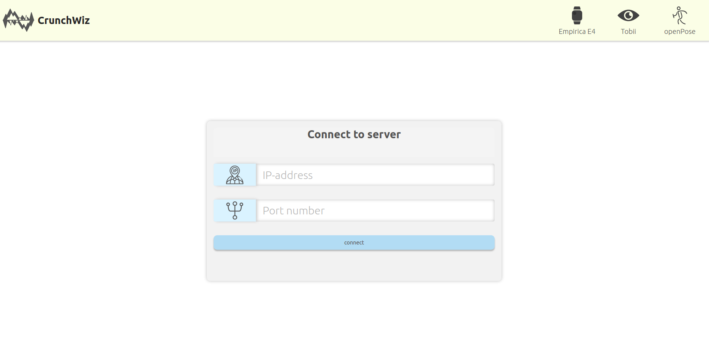

<div align="center">
  
<br>
<br>
CrunchWiz is a full-stack application for calculating measurements from sensors, and displaying them in a dashboard.
<br>
<br>
<p align="center">
  <a href="#getting-started">Getting started</a> •
  <a href="#running-the-program">Running the program</a> •
  <a href="#running-tests">Running tests</a> •
  <a href="#links">Links</a>
</p>
</div>

---

# Getting started

### Prerequisites
- [Python 3.6.x](https://www.python.org/downloads/) (Python 3.6.x is mandatory for eyetracker to work)
- [pip](https://pypi.org/project/pip/)
- [NodeJS](https://nodejs.org/en/)


### Setting up the backend
```bash
# Navigate to the backend folder
$ cd backend

# Install the required python dependencies
$ pip install -r requirements.txt
```

In addition to installing the python dependencies, you will need to follow the instructions to set up the
[Empatica e4 wristband](docs/empatica_setup.md), [Tobii eyetracker](docs/eyetracker_setup.md) and
[OpenPose](docs/openpose_setup.md), which can be found in the docs folder.

### Setting up the frontend
```bash
# Navigate to the backend folder
$ cd frontend

# Install the node dependencies
$ npm install
```

# Running the program
After following the instructions above, and having set up the devices, you can start the program.
```bash
# Navigate to the backend folder
$ cd backend

# Run the backend program
$ python main.py
```
```bash
# Navigate to the frontend folder
$ cd frontend

# Run the frontend program
$ npm start
```
The dashboard website should now show up. You can now enter the IP and port address
belonging to the backend program. If you are running both the backend and the frontend on the
same computer, these will be *127.0.0.1* and *8888* respectively. Otherwise the IP adress
will be printed in the python terminal window.



After starting the backend and frontend, and inputting the IP and port address, a websocket connection
will be established. The calculated measurements will now be shown in the dashboard.


You can
view more detailed information about them by clicking on a measurement.

# Running tests
Our test suite consists of unit tests, integration tests and linter for the backend, whereas the
frontend only uses linter. The reason for this is that the frontend was a low priority,
and more of a way to showcase what we have developed.

### Unit and integration tests
We achieved 80% test coverage of our backend. Most of the code is tested with our test suite, with the
exception of the connections to the devices, which we thoroughly tested manually.
```bash
# Navigate to the backend folder
$ cd backend

# Run the test suite with coverage report
$ python -m pytest --cov=crunch/
```

### Linter backend
```bash
# Navigate to the backend folder
$ cd backend

# Run the linter
$ flake8

# Optional: run the "import formatter"
$ isort -rc . --skip venv openpose
```

### Linter frontend
```bash
# Navigate to the frontend folder
$ cd frontend

# Run the linter
$ npm run lint
```

# Links
- [How to simply add a new measurement to the pipeline](docs/new_measurement.md)
- [Architecture and implementation](docs/architecture.md)
- [Empatica E4 wristband setup](docs/empatica_setup.md)
- [Tobii eyetracker setup](docs/eyetracker_setup.md)
- [OpenPose setup](docs/openpose_setup.md)
