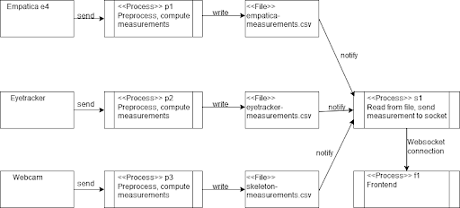
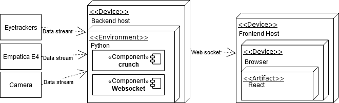

# Architecture
Crunchwiz consists of a backend python program reading the raw data from the device, processing
the data, and sending the data through a websocket to a react frontend.
In the backend, we run three separate processes, one for each device, as well as the main
process running the websocket. These three processes are entirely decoupled, and only
handle the raw data stream and processing of their own respective devices. The three processes
then write the computed measurements to a csv file, which the websocket reads, and sends
to the react frontend.

### Logical view

### Physical view

# Implementation
We will describe how the three device processes works, since they are the most complex part of our
program. They are all structured in the same way, so this explanation works generally for all three.

### api.py
Here we define a layer of abstraction of the device connection. We define a class which
connects to the device, receives the devices raw data stream, and sends that data stream
to whichever handler (handler.py) is subscribed to it.

### handler.py
Here we define a general "handler" of the data stream. This handler stores all the data
it receives from the API, and decides when to compute the measurements, and write the result to
the csv files. Each measurement has its own instantiation of the handler.

### main.py
Here we instantiate the api as well as all the handlers, and subscribe the handlers
to the raw data stream they want to be subscribed to, we also define parameters like
window size (how many data points is sent to the measurement function) here. This is 
the main entry point into each device process.

### measurement/__________.py
This directory is where we store all the measurement functions.
Each measurement which is computed and sent to the frontend, has its own measurement file.
See [the guide on how to add a new measurement](new_measurement.md) for a practical example
of how this structure works.
